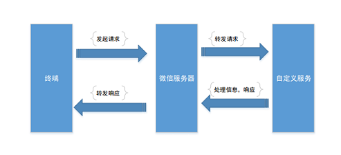
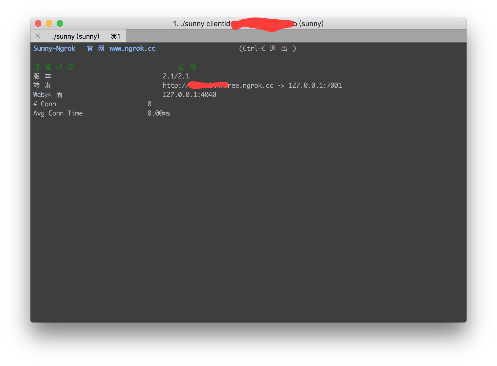

# Koa2微信公众号开发(一) 本地开发调试环境搭建

*最近沉迷吃鸡不能自拔，好久没更新文章了*。后续将陆续完善《Koa2微信公众号开发》。

## 一、简介
关于微信公众号的介绍就省略了，自行搜索。注册过程也不说了。我们会直接注册测试号来实现代码。这将会是个全面讲解微信公众号开发的系列教程。本篇是该系列的第一篇，本地开发环境搭建以及接入微信。
在开始之前最好去看看开发者文档[微信公众平台技术文档](https://mp.weixin.qq.com/wiki?t=resource/res_main&id=mp1445241432)

## 二、本地开发调试环境搭建

### 2.1 开发环境
```
- MacOs
- Node v8.9.1
- Koa2
```
### 2.2 微信公众平台开发的基本原理
我们先来看看微信公众平台开发的基本原理：在进行微信开发的时候,需要在我们在自己的服务器上部署服务对微信消息进行处理。微信服务器就相当于一个转发服务器。终端（手机、Pad等）发起请求至微信服务器，微信服务器然后将请求转发给自定义服务（这里就是我们的具体实现）。服务处理完毕，然后转发给微信服务器，微信服务器再将具体响应回复到终端，通信协议为：HTTP；数据格式为：XML。

我们的服务需要做的就是对请求做出响应，解析XML,进行相应的处理后再返回特定的XML。

### 2.3 ngrok微信本地开发

这儿我们了解到了接入微信开发需要一个自己的响应服务器，我们可以购买服务器或者新浪云百度云之类的服务。但是在我们开发阶段这样做是很麻烦的，我们需要搭建一个好用的本地调试环境，将内网映射出去，让外网能够访问的。
这儿推荐使用[Ngrok](https://www.ngrok.cc/)服务。win、mac都能方便使用，而且稳定，外网域名是固定的。

打开它的网站[https://www.ngrok.cc/](https://www.ngrok.cc/)注册登录然后开通隧道。同时你需要下载相应的客户端
在win中这是个批处理文件，运行它然后填入相应的隧道id回车即可，在Mac中命令行执行如下命令。
```bash
./sunny clientid 隧道id
```
运行成功会返回ngrok换发域名。

*更多参见ngrok官网教程*

到此，我们来让node服务跑起来，并通过ngrok的域名外网访问

```bash
mkdir koa2-wechat && cd koa2-wechat
npm install koa --save
```
新建app.js
```javascript
const Koa = require('koa')
const app = new Koa()

app.use(async ctx => {
  ctx.body = 'JavaScript之禅'
});

app.listen(7001);
```

我们运行app.js，将服务跑起来，浏览器打开`localhost:7001`我们将能够看见返回了`JavaScript之禅`。这儿推荐使用[supervisor]()，它会监视你对代码的改动,并自动重动 Node

```bash
npm install -g supervisor
supervisor app.js
```

接下来就是用前面讲的ngrok进行内网转发了

```bash
./sunny clientid 隧道id
```

如果不出问题，你打开你的转发域名*http://**.free.ngrok.cc*也将看见`JavaScript之禅`

## 三、接入微信公众平台开发

### 3.1 接入流程 

接入微信公众平台开发，开发者需要按照如下步骤完成：

1、填写服务器配置

2、验证服务器地址的有效性

3、依据接口文档实现业务逻辑

我们登录微信公众平台接口测试帐号[https://mp.weixin.qq.com/debug/cgi-bin/sandbox?t=sandbox/login](https://mp.weixin.qq.com/debug/cgi-bin/sandbox?t=sandbox/login)，登录后填写接口配置信息*(你的url地址以及token)*，这时肯定不能配置成功的。我们需要验证服务器地址的有效性，开发者提交信息后，微信服务器将发送GET请求到填写的服务器地址URL上，GET请求携带参数如下表所示：

| 参数        | 描述                                       |
| --------- | ---------------------------------------- |
| signature | 微信加密签名，signature结合了开发者填写的token参数和请求中的timestamp参数、nonce参数。 |
| timestamp | 时间戳                                      |
| nonce     | 随机数                                      |
| echostr   | 随机字符串                                    |

开发者通过检验signature对请求进行校验。若确认此次GET请求来自微信服务器，原样返回echostr参数内容，则接入生效，成为开发者成功，否则接入失败。加密/校验流程如下：

1. 将token、timestamp、nonce三个参数进行字典序排序 
2. 将三个参数字符串拼接成一个字符串进行sha1加密 
3. 开发者获得加密后的字符串可与signature对比，标识该请求来源于微信

**Talk is cheap. Show me the code**

### 3.2 koa2验证服务器地址的有效性 

修改app.js

```javascript
const Koa = require('koa')
const app = new Koa()
// 引入node加密模块进行sha1加密
const crypto = require('crypto')

const config = {
  wechat: {
    appID: 'appID',
    appsecret: 'appsecret',
    token: 'zenofjavascript',
  }
}

app.use(async ctx => {
    const { signature, timestamp, nonce, echostr } = ctx.query  
    const token = config.wechat.token
    let hash = crypto.createHash('sha1')
    const arr = [token, timestamp, nonce].sort()
    hash.update(arr.join(''))
    const shasum = hash.digest('hex')
    if(shasum === signature){
      return ctx.body = echostr
    }
    ctx.status = 401      
    ctx.body = 'Invalid signature'
})

app.listen(7001)
```

进入测试号的页面重新提交接口配置信息，你将会看见一个一闪而过的配置成功过提示框。恭喜，这标志着你正式跳进了微信开发的坑了。

本篇文章到此结束，下一节将讲解公众号的消息回复功能

## 参考链接

- [微信公众平台开发者文档](https://mp.weixin.qq.com/wiki?t=resource/res_main&id=mp1445241432)
- [公众号测试号](https://mp.weixin.qq.com/debug/cgi-bin/sandboxinfo?action=showinfo&t=sandbox/index)
- [Ngrok](https://www.ngrok.cc/)
- [koa](http://koajs.com/)
- [supervisor](https://www.npmjs.com/package/supervisor)

**左手代码右手砖，抛砖引玉**

