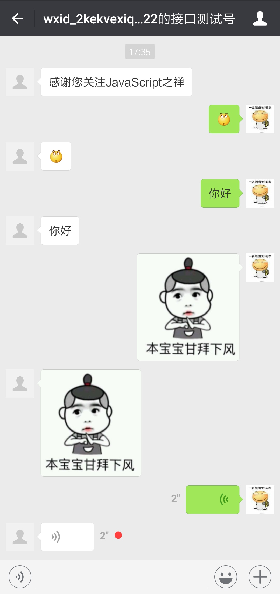

# Koa2微信公众号开发(二) 消息管理

Github源码: [https://github.com/ogilhinn/koa2-wechat](https://github.com/ogilhinn/koa2-wechat)

## 一、简介

上一节，我们搭建好了本地调试环境并且接入了微信公众测试号。这一节我们就来看看公众号的消息管理。并实现一个自动回复功能。

*阅读建议：微信公众平台开发文档[https://mp.weixin.qq.com/wiki](https://mp.weixin.qq.com/wiki)*

## 二、接收消息

当普通微信用户向公众账号发消息时，微信服务器将POST消息的**XML**数据包到开发者填写的URL上。

### 2.1 接收普通消息数据格式

XML的结构基本固定，不同的消息类型略有不同。

用户发送文本消息时，微信公众账号接收到的XML数据格式如下所示：

```xml
<xml>
  <ToUserName><![CDATA[toUser]]></ToUserName>
  <FromUserName><![CDATA[fromUser]]></FromUserName>
  <CreateTime>createTime</CreateTime>
  <MsgType><![CDATA[text]]></MsgType>
  <Content><![CDATA[this is a test]]></Content>
  <MsgId>1234567890123456</MsgId>
</xml>
```

用户发送图片消息时，微信公众账号接收到的XML数据格式如下所示：

```xml
<xml> 
  <ToUserName><![CDATA[toUser]]></ToUserName>
  <FromUserName><![CDATA[fromUser]]></FromUserName>
  <CreateTime>1348831860</CreateTime> 
  <MsgType><![CDATA[image]]></MsgType> 
  <PicUrl><![CDATA[this is a url]]></PicUrl>
  <MediaId><![CDATA[media_id]]></MediaId> 
  <MsgId>1234567890123456</MsgId>
</xml>
```
*其他消息消息类型的结构请查阅【微信公众平台开发文档】*

对于POST请求的处理，koa2没有封装获取参数的方法，需要通过自己解析上下文context中的原生node.js请求对象request。我们将用到[row-body](https://github.com/stream-utils/raw-body)这个模块来拿到数据。

### 2.2 先来优化之前的代码

这一节的代码紧接着上一届实现的代码，在上一届的基础上轻微改动了下。

```javascript
'use strict'

const Koa = require('koa')
const app = new Koa()
const crypto = require('crypto')
// 将配置文件独立到config.js
const config = require('./config')

app.use(async ctx => {
  // GET 验证服务器
  if (ctx.method === 'GET') {
    const { signature, timestamp, nonce, echostr } = ctx.query
    const TOKEN = config.wechat.token
    let hash = crypto.createHash('sha1')
    const arr = [TOKEN, timestamp, nonce].sort()
    hash.update(arr.join(''))
    const shasum = hash.digest('hex')
    if (shasum === signature) {
      return ctx.body = echostr
    }
    ctx.status = 401
    ctx.body = 'Invalid signature'
  } else if (ctx.method === 'POST') { // POST接收数据
    // TODO
  }
});

app.listen(7001);

```

这儿我们在只在`GET`中验证了签名值是否合法，实际上我们在`POST`中也应该验证签名。

将签名验证写成一个函数

```javascript
function getSignature (timestamp, nonce, token) {
  let hash = crypto.createHash('sha1')
  const arr = [token, timestamp, nonce].sort()
  hash.update(arr.join(''))
  return hash.digest('hex')
}
```

优化代码，再`POST`中也加入验证

```javascript
...

app.use(async ctx => {
  const { signature, timestamp, nonce, echostr } = ctx.query
  const TOKEN = config.wechat.token
  if (ctx.method === 'GET') {
    if (signature === getSignature(timestamp, nonce, TOKEN)) {
      return ctx.body = echostr
    }
    ctx.status = 401
    ctx.body = 'Invalid signature'
  }else if (ctx.method === 'POST') {
    if (signature !== getSignature(timestamp, nonce, TOKEN)) {
      ctx.status = 401
      return ctx.body = 'Invalid signature'
    }
    // TODO
  }
});

...
```

到这儿我们都没有开始实现接受XML数据包的功能，而是在修改之前的代码。这是为了演示在实际开发中的过程，写任何代码都不是一步到位的，好的代码都是改出来的。

### 2.3 接收公众号普通消息的XML数据包

现在开始进入本节的重点，接受XML数据包并转为JSON

```bash
$ npm install raw-body --save
```

```javascript
...
const getRawBody = require('raw-body')
...

// TODO
// 取原始数据
const xml = await getRawBody(ctx.req, {
  length: ctx.request.length,
  limit: '1mb',
  encoding: ctx.request.charset || 'utf-8'
});
console.log(xml)
return ctx.body = 'success' // 直接回复success，微信服务器不会对此作任何处理
```

给你的测试号发送文本消息，你可以在命令行看见打印出如下数据

```xml
<xml>
  <ToUserName><![CDATA[gh_9d2d49e7e006]]></ToUserName>
  <FromUserName><![CDATA[oBp2T0wK8lM4vIkmMTJfFpk6Owlo]]></FromUserName>
  <CreateTime>1516940059</CreateTime>
  <MsgType><![CDATA[text]]></MsgType>
  <Content><![CDATA[JavaScript之禅]]></Content>
  <MsgId>6515207943908059832</MsgId>
</xml>
```

恭喜，到此你已经可以接收到XML数据了。😯 但是我们还需要将XML转为JSON方便我们的使用，我们将用到[xml2js](https://github.com/Leonidas-from-XIV/node-xml2js)这个包

```
$ npm install xml2js --save
```

我们需要写一个解析XML的异步函数，返回一个Promise对象

```javascript
function parseXML(xml) {
  return new Promise((resolve, reject) => {
    xml2js.parseString(xml, { trim: true, explicitArray: false, ignoreAttrs: true }, function (err, result) {
      if (err) {
        return reject(err)
      }
      resolve(result.xml)
    })
  })
}
```

接着调用`parseXML`方法，并打印出结果

```javascript
...
const formatted = await parseXML(xml)
console.log(formatted)
return ctx.body = 'success'
```

一切正常的话*(实际开发中你可能会遇到各种问题)*，命令行将打印出如下JSON数据

```json
{ ToUserName: 'gh_9d2d49e7e006',
  FromUserName: 'oBp2T0wK8lM4vIkmMTJfFpk6Owlo',
  CreateTime: '1516941086',
  MsgType: 'text',
  Content: 'JavaScript之禅',
  MsgId: '6515212354839473910' }
```

到此，我们就能处理微信接收到的消息了，你可以自己测试关注、取消关注、发送各种类型的消息看看这个类型的消息所对应的XML数据格式都是怎么样的

## 三、回复消息

当用户发送消息给公众号时（或某些特定的用户操作引发的事件推送时），会产生一个POST请求，开发者可以在响应包（Get）中返回特定XML结构，来对该消息进行响应（现支持回复文本、图片、图文、语音、视频、音乐）。严格来说，发送被动响应消息其实并不是一种接口，而是对微信服务器发过来消息的一次回复。

### 3.1 被动回复用户消息数据格式 

前面说了交互的数据格式为XML，接收消息是XML的，我们回复回去也应该是XML。

微信公众账号回复用户文本消息时的XML数据格式如下所示：

```xml
<xml> 
  <ToUserName><![CDATA[toUser]]></ToUserName> 
  <FromUserName><![CDATA[fromUser]]></FromUserName> 
  <CreateTime>12345678</CreateTime> 
  <MsgType><![CDATA[text]]></MsgType> 
  <Content><![CDATA[你好]]></Content> 
</xml>
```

微信公众账号回复用户图片消息时的XML数据格式如下所示:

```xml
<xml>
  <ToUserName><![CDATA[toUser]]></ToUserName>
  <FromUserName><![CDATA[fromUser]]></FromUserName>
  <CreateTime>12345678</CreateTime>
  <MsgType><![CDATA[image]]></MsgType>
  <Image><MediaId><![CDATA[media_id]]></MediaId></Image>
</xml>
```

篇幅所限就不一一列举了，请查阅【微信公众平台开发文档】

前面的代码都是直接回复success，不做任何处理。先来撸一个自动回复吧。收到消息后就回复`这儿是JavaScript之禅`

```javascript
// return ctx.body = 'success' // 直接success
ctx.type = 'application/xml'
return ctx.body = `<xml> 
<ToUserName><![CDATA[${formatted.FromUserName}]]></ToUserName> 
<FromUserName><![CDATA[${formatted.ToUserName}]]></FromUserName> 
<CreateTime>${new Date().getTime()}</CreateTime> 
<MsgType><![CDATA[text]]></MsgType> 
<Content><![CDATA[这儿是JavaScript之禅]]></Content> 
</xml>`
```

### 3.2 使用ejs模板引擎处理回复内容

从这一小段代码中可以看出，被动回复消息就是把你想要回复的内容按照约定的XML格式返回即可。但是一段一段的拼XML那多麻烦。我们来加个模板引擎方便我们处理XML。模板引擎有很多，[ejs](https://github.com/mde/ejs) 是其中一种，它使用起来十分简单

首先下载并引入[ejs](https://github.com/mde/ejs)

```bash
$ npm install ejs --save
```

如果你之前没用过现在只需要记住下面这几个语法，以及`ejs.compile()`方法

1. `<% code %>`：运行 JavaScript 代码，不输出
2. `<%= code %>`：显示转义后的 HTML内容
3. `<%- code %>`：显示原始 HTML 内容

可以先看看这个`ejs`的小demo：

```javascript
const ejs = require('ejs')
let tpl = `
<xml> 
  <ToUserName><![CDATA[<%-toUsername%>]]></ToUserName> 
  <FromUserName><![CDATA[<%-fromUsername%>]]></FromUserName> 
  <CreateTime><%=createTime%></CreateTime> 
  <MsgType><![CDATA[<%=msgType%>]]></MsgType> 
  <Content><![CDATA[<%-content%>]]></Content> 
</xml>
`
const compiled = ejs.compile(tpl)
let mess = compiled({
  toUsername: '1234',
  fromUsername: '12345',
  createTime: new Date().getTime(),
  msgType: 'text',
  content: 'JavaScript之禅',
})

console.log(mess)

/* 将打印出如下信息 
 *================
<xml>
  <ToUserName><![CDATA[1234]]></ToUserName>
  <FromUserName><![CDATA[12345]]></FromUserName>
  <CreateTime>1517037564494</CreateTime>
  <MsgType><![CDATA[text]]></MsgType>
  <Content><![CDATA[JavaScript之禅]]></Content>
</xml>
*/
```

现在来编写被动回复消息的模板，各种`if else`，这儿就直接贴代码了

```ejs
<xml>
  <ToUserName><![CDATA[<%-toUsername%>]]></ToUserName>
  <FromUserName><![CDATA[<%-fromUsername%>]]></FromUserName>
  <CreateTime><%=createTime%></CreateTime>
  <MsgType><![CDATA[<%=msgType%>]]></MsgType>
  <% if (msgType === 'news') { %>
  <ArticleCount><%=content.length%></ArticleCount>
  <Articles>
  <% content.forEach(function(item){ %>
  <item>
  <Title><![CDATA[<%-item.title%>]]></Title>
  <Description><![CDATA[<%-item.description%>]]></Description>
  <PicUrl><![CDATA[<%-item.picUrl || item.picurl || item.pic || item.thumb_url %>]]></PicUrl>
  <Url><![CDATA[<%-item.url%>]]></Url>
  </item>
  <% }); %>
  </Articles>
  <% } else if (msgType === 'music') { %>
  <Music>
  <Title><![CDATA[<%-content.title%>]]></Title>
  <Description><![CDATA[<%-content.description%>]]></Description>
  <MusicUrl><![CDATA[<%-content.musicUrl || content.url %>]]></MusicUrl>
  <HQMusicUrl><![CDATA[<%-content.hqMusicUrl || content.hqUrl %>]]></HQMusicUrl>
  </Music>
  <% } else if (msgType === 'voice') { %>
  <Voice>
  <MediaId><![CDATA[<%-content.mediaId%>]]></MediaId>
  </Voice>
  <% } else if (msgType === 'image') { %>
  <Image>
  <MediaId><![CDATA[<%-content.mediaId%>]]></MediaId>
  </Image>
  <% } else if (msgType === 'video') { %>
  <Video>
  <MediaId><![CDATA[<%-content.mediaId%>]]></MediaId>
  <Title><![CDATA[<%-content.title%>]]></Title>
  <Description><![CDATA[<%-content.description%>]]></Description>
  </Video>
  <% } else { %>
  <Content><![CDATA[<%-content%>]]></Content>
  <% } %>
</xml>
```

现在就可以使用我们写好的模板回复XML消息了

```javascript
...
const formatted = await parseXML(xml)
console.log(formatted)
let info = {}
let type = 'text'
info.msgType = type
info.createTime = new Date().getTime()
info.toUsername = formatted.FromUserName
info.fromUsername = formatted.ToUserName
info.content = 'JavaScript之禅'
return ctx.body = compiled(info)
```

我们可以把这个回复消息的功能写成一个函数

```javascript
function reply (content, fromUsername, toUsername) {
  var info = {}
  var type = 'text'
  info.content = content || ''
  // 判断消息类型
  if (Array.isArray(content)) {
    type = 'news'
  } else if (typeof content === 'object') {
    if (content.hasOwnProperty('type')) {
      type = content.type
      info.content = content.content
    } else {
      type = 'music'
    }
  }
  info.msgType = type
  info.createTime = new Date().getTime()
  info.toUsername = toUsername
  info.fromUsername = fromUsername
  return compiled(info)
}
```

在回复消息的时候直接调用这个方法即可

```javascript
...
const formatted = await parseXML(xml)
console.log(formatted)
const content = 'JavaScript之禅'
const replyMessageXml = reply(content, formatted.ToUserName, formatted.FromUserName)
return ctx.body = replyMessageXml
```

现在为了测试我们所写的这个功能，来实现一个【学我说话】的功能:

回复`音乐`将返回一个音乐类型的消息，回复文本图片，语音，公众号将返回同样的内容，当然了你可以在这个基础上进行各种发挥。

```javascript

....
const formatted = await parseXML(xml)
console.log(formatted)
let content = ''
if (formatted.Content === '音乐') {
  content = {
    type: 'music',
    content: {
      title: 'Lemon Tree',
      description: 'Lemon Tree',
      musicUrl: 'http://mp3.com/xx.mp3'
    },
  }
} else if (formatted.MsgType === 'text') {
  content = formatted.Content
} else if (formatted.MsgType === 'image') {
  content = {
    type: 'image',
    content: {
      mediaId: formatted.MediaId
    },
  }
} else if (formatted.MsgType === 'voice') {
  content = {
    type: 'voice',
    content: {
      mediaId: formatted.MediaId
    },
  }
} else {
  content = 'JavaScript之禅'
}
const replyMessageXml = reply(content, formatted.ToUserName, formatted.FromUserName)
console.log(replyMessageXml)
ctx.type = 'application/xml'
return ctx.body = replyMessageXml
```

nice，到此时我们的测试号已经能够根据我们的消息做出相应的回应了



本篇再上一节的代码基础上做了一些优化，并重点讲解微信公众号的消息交互，最后实现了个【学我说话】的小功能。下一篇，我们将继续补充消息管理相关的知识。**最后再说一句：看文档** 😉

## 参考链接

- 微信公众平台开发文档：[https://mp.weixin.qq.com/wiki](https://mp.weixin.qq.com/wiki)
- raw-body：[https://github.com/stream-utils/raw-body](https://github.com/stream-utils/raw-body)
- xml2js: [https://github.com/Leonidas-from-XIV/node-xml2js](https://github.com/Leonidas-from-XIV/node-xml2js)
- ejs: [https://github.com/mde/ejs](https://github.com/mde/ejs)
- 源码： [https://github.com/ogilhinn/koa2-wechat](https://github.com/ogilhinn/koa2-wechat)

**左手代码右手砖，抛砖引玉**


