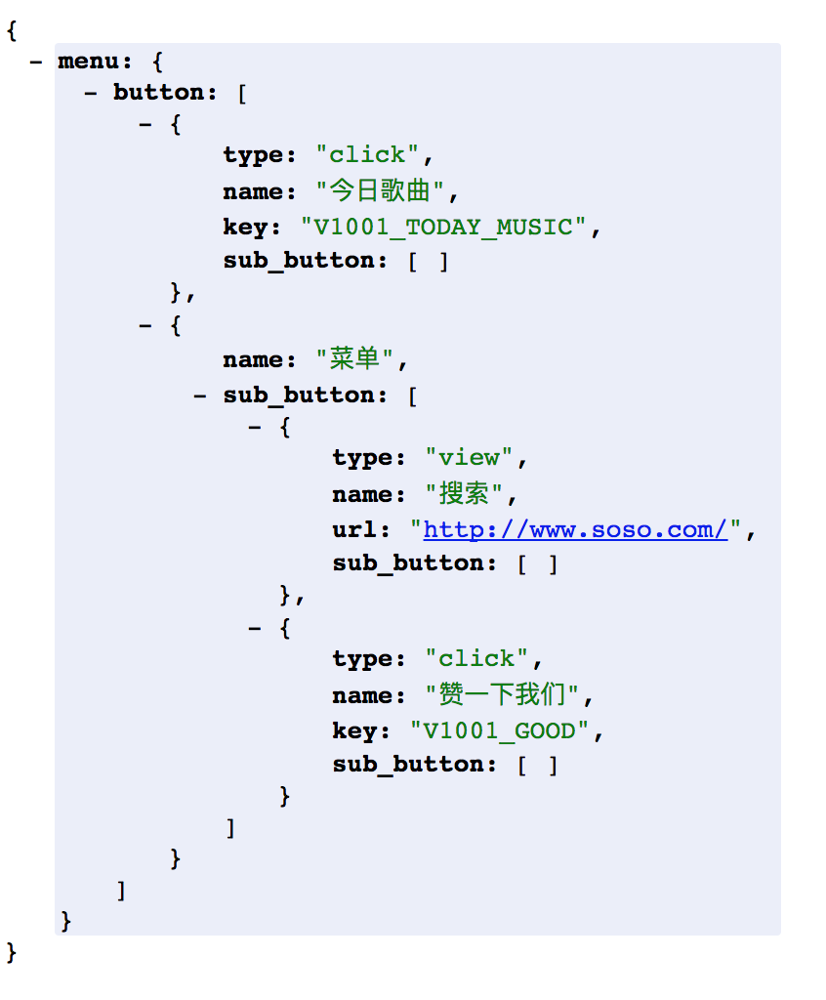
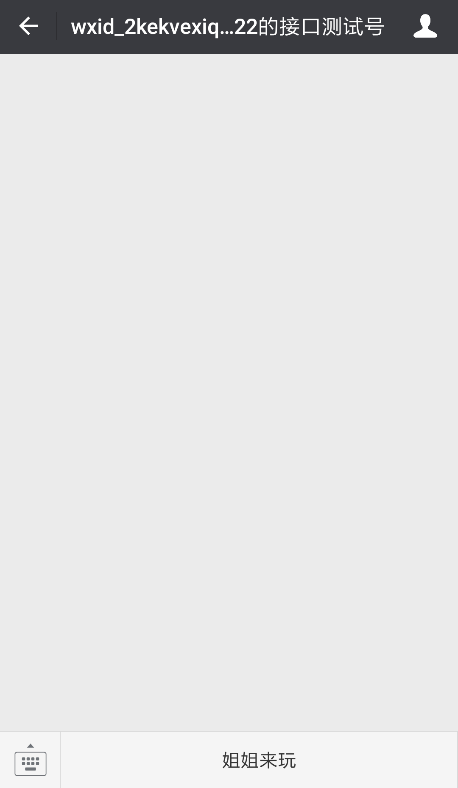
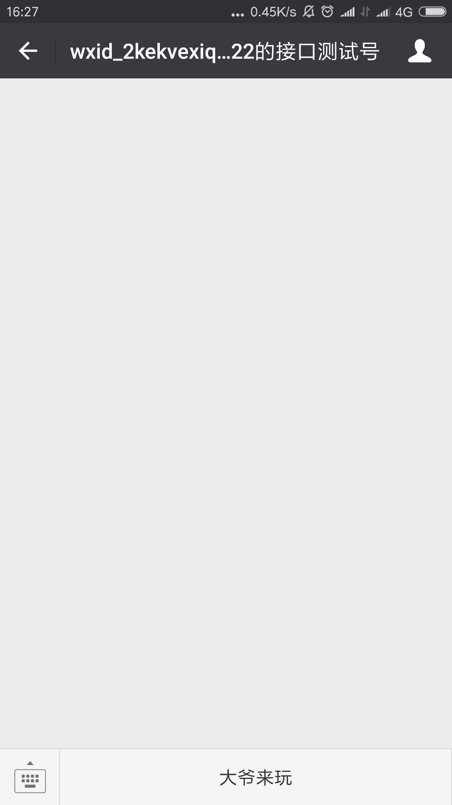

# Koa2微信公众号开发(四) 自定义公众号菜单

上一节我们成功的处理和获取到了access_token，现在我们就可以利用它来做很多事了。比如这一节我们将讲的自定义菜单

## 一、简介
> 自定义菜单能够帮助公众号丰富界面，让用户更好更快地理解公众号的功能。

### 1.1 自定义菜单的介绍

关于自定义菜单我们需要注意：

1. 自定义菜单最多包括3个一级菜单，每个一级菜单最多包含5个二级菜单。
2. 一级菜单最多4个汉字，二级菜单最多7个汉字，多出来的部分将会以“...”代替。
3. 创建自定义菜单后，菜单的刷新策略是，在用户进入公众号会话页或公众号profile页时，如果发现上一次拉取菜单的请求在5分钟以前，就会拉取一下菜单，如果菜单有更新，就会刷新客户端的菜单。测试时可以尝试取消关注公众账号后再次关注，则可以看到创建后的效果

*注意：未认证的订阅号没有自定义菜单的权限*

### 1.2 自定义菜单的按钮类型

自定义菜单接口可实现多种类型按钮: 

1. click：点击推事件
2. view：跳转URL
3. scancode_push：扫码推事件
4. scancode_waitmsg：扫码推事件且弹出“消息接收中”提示框
5. pic_sysphoto：弹出系统拍照发图
6. pic_photo_or_album：弹出拍照或者相册发图
7. pic_weixin：弹出微信相册发图器
8. location_select：弹出地理位置选择器
9. media_id：下发素材类型消息
10. view_limited：跳转图文消息URL

还是那句话具体看文档[自定义菜单创建接口](https://mp.weixin.qq.com/wiki?t=resource/res_main&id=mp1421141013)，这儿不详细讲这些了

## 二、调用自定义菜单接口

### 2.1 创建自定义菜单

在上一节的最后我们已经实现过了创建菜单

```javascript
// 创建菜单
async createMenu(menu) {
  const { accessToken } = await this.ensureAccessToken()
  let url = this.prefix + 'menu/create?access_token=' + accessToken
  const response = await axios.post(url, menu)
  return response.data
}
```

这儿我们直接把新方法可以添加在`prototype`吧

```javascript
class API {
  
}

API.prototype.createMenu = async function(menu) {}

```
我们来看看创建菜单的参数配置说明


| 参数         | 是否必须                        | 说明                                       |
| ---------- | --------------------------- | ---------------------------------------- |
| button     | 是                           | 一级菜单数组，个数应为1~3个                          |
| sub_button | 否                           | 二级菜单数组，个数应为1~5个                          |
| type       | 是                           | 菜单的响应动作类型，view表示网页类型，click表示点击类型，miniprogram表示小程序类型 |
| name       | 是                           | 菜单标题，不超过16个字节，子菜单不超过60个字节                |
| key        | click等点击类型必须                | 菜单KEY值，用于消息接口推送，不超过128字节                 |
| url        | view、miniprogram类型必须        | 网页 链接，用户点击菜单可打开链接，不超过1024字节。 type为miniprogram时，不支持小程序的老版本客户端将打开本url。 |
| media_id   | media_id类型和view_limited类型必须 | 调用新增永久素材接口返回的合法media_id                  |
| appid      | miniprogram类型必须             | 小程序的appid（仅认证公众号可配置）                     |
| pagepath   | miniprogram类型必须             | 小程序的页面路径                                 |


既然创建好了菜单，我们就对菜单事件做出点儿回应吧

### 2.2 回应自定义菜单事件

这儿我们用到了之前封装好的处理消息交互的wechat。我们在点击今日歌曲后将收一首歌曲

```javascript
app.use(wechat(config, async (message, ctx) => {
  // TODO
  console.log(message)
  if (message.MsgType === 'event' && message.EventKey === 'V1001_TODAY_MUSIC') {
    return {
      type: 'music',
      content: {
        title: 'Lemon Tree',
        description: 'Lemon Tree',
        musicUrl: 'http://mp3.com/xx.mp3',
      },
    }
  }
}))
```

这只演示了click类型的菜单，其他的可以自己去测试测试


### 2.3 自定义菜单查询接口
使用接口创建自定义菜单后，开发者还可使用接口查询自定义菜单的结构。另外请注意，在设置了个性化菜单后，使用本自定义菜单查询接口可以获取默认菜单和全部个性化菜单信息。

**请求说明**
```javascript
http请求方式：GET
https://api.weixin.qq.com/cgi-bin/menu/get?access_token=ACCESS_TOKEN
```
我们在API类上新加个`getMenu()`方法
```javascript
// 查询菜单
API.prototype.getMenu = async function () {
  const { accessToken } = await this.ensureAccessToken()
  var url = this.prefix + 'menu/get?access_token=' + accessToken
  const response = await axios.get(url)
  return response.data
}
```

这是我们可以调用它来试试看

```javascript
app.use(async (ctx) => {
  // TODO
  const result = await api.getMenu()
  console.log(result)
  ctx.body = result
})
```

在浏览器中打开你就可以看见返回如下数据



*这儿顺带给大家安利一个格式化JSON数据的Chrome插件[JSONView](https://chrome.google.com/webstore/detail/jsonview/chklaanhfefbnpoihckbnefhakgolnmc)，它可以帮助我们更好的查看JSON数据*


### 2.4 自定义菜单删除接口

使用接口创建自定义菜单后，开发者还可使用接口删除当前使用的自定义菜单。另请注意，在个性化菜单时，调用此接口会删除默认菜单及全部个性化菜单。

**请求说明**

```javascript
http请求方式：GET
https://api.weixin.qq.com/cgi-bin/menu/delete?access_token=ACCESS_TOKEN
```

还是和之前一样，我们在API类上新加个`removeMenu`方法

```javascript
// 删除菜单
API.prototype.getMenu = async function () {
  const { accessToken } = await this.ensureAccessToken()
  const url = this.prefix + 'menu/delete?access_token=' + accessToken;
  const response = await axios.get(url)
  return response.data
}
```

同样，我们来调用它，成功删除后将返回

```javascript
{"errcode":0,"errmsg":"ok"}
```


### 2.5 个性化菜单接口

为了帮助公众号实现灵活的业务运营，微信公众平台新增了个性化菜单接口，开发者可以通过该接口，让公众号的不同用户群体看到不一样的自定义菜单。该接口开放给已认证订阅号和已认证服务号

#### 2.5.1 添加个性化菜单

这些添加删除个性化菜单都是和之前一样，去请求接口即可。

**请求说明**

```javascript
http请求方式：POST
https://api.weixin.qq.com/cgi-bin/menu/addconditional?access_token=ACCESS_TOKEN
```

成功后将反回

```javascript
{"menuid":"208379533"}
```

新增一个`addConditionalMenu()`方法

```javascript
// 添加个性化菜单
API.prototype.addConditionalMenu = async function (menu) {
  const { accessToken } = await this.ensureAccessToken()
  const url = this.prefix + 'menu/addconditional?access_token=' + accessToken
  const response = await axios.post(url, menu)
  return response.data
}
```
创建菜单时，需要将菜单内容组织成如下结构，以POST的方式向微信服务器提交：

```javascript
{
"button":[
       ...
     ],
"matchrule":{
  "tag_id":"2",
  "sex":"1",
  "country":"中国",
  "province":"广东",
  "city":"广州",
  "client_platform_type":"2",
  "language":"zh_CN"
  }
}
```

这儿这个menu数据比创建普通的菜单多了一个`matchrule`参数。这个参数就是菜单匹配规则

我们来试试匹配男性用户就显示`大爷来玩` 女性显示 `姐姐来玩`

准备两组数据，调用之前写得`addConditionalMenu()`方法添加这两个个性化菜单。

```javascript
const menu1 = {
  "button": [
    {
      "type": "click",
      "name": "大爷来玩",
      "key": "V1001_TODAY_MUSIC"
    }],
  "matchrule": {
    "sex": "1",
  }
}

const menu2 = {
  "button": [
    {
      "type": "click",
      "name": "姐姐来玩",
      "key": "V1001_TODAY_MUSIC"
    }],
  "matchrule": {
    "sex": "2",
  }
}
```

现在不同性别的用户所看到的菜单界面也就不一样了





#### 2.5.3 删除个性化菜单

**请求说明**

```javascript
http请求方式：POST
https://api.weixin.qq.com/cgi-bin/menu/delconditional?access_token=ACCESS_TOKEN
```

**请求示例**

```javascript
{"menuid":"208379533"}
// 请求时需要带上menuid, menuid为菜单id，可以通过自定义菜单查询接口获取。
```

#### 2.5.3 测试个性化菜单

**请求说明**

```javascript
http请求方式：POST
https://api.weixin.qq.com/cgi-bin/menu/trymatch?access_token=ACCESS_TOKEN
```

**请求示例**

```javascript
{"user_id":"weixin"}
```

user_id可以是粉丝的OpenID，也可以是粉丝的微信号。该接口将会返回该粉丝的菜单配置

这儿就不贴代码了，都是相似的。可以自己写了练习下。

**GitHub源码地址：[https://github.com/ogilhinn/koa2-wechat/tree/master/lesson4](https://github.com/ogilhinn/koa2-wechat/tree/master/lesson4)**

## 三、小总结

到这儿，自定义菜单相关的讲完了，你会发现我们本节写的自定义菜单的方法都是类似。请求相应的接口即可，相当简单。不过很多内容都是点到为止，这一节的重点还是需要要各位同学在写代码的时候进行实际的测试，如测试不同类型的菜单，匹配不同的用户。


## 参考链接

- 自定义菜单创建接口： [https://mp.weixin.qq.com/wiki?t=resource/res_main&id=mp1421141013](https://mp.weixin.qq.com/wiki?t=resource/res_main&id=mp1421141013)
- JSONView[https://chrome.google.com/webstore/detail/jsonview/chklaanhfefbnpoihckbnefhakgolnmc](https://chrome.google.com/webstore/detail/jsonview/chklaanhfefbnpoihckbnefhakgolnmc)
- GitHub源码地址：[https://github.com/ogilhinn/koa2-wechat/tree/master/lesson4](https://github.com/ogilhinn/koa2-wechat/tree/master/lesson4)


**左手代码右手砖，抛砖引玉**


